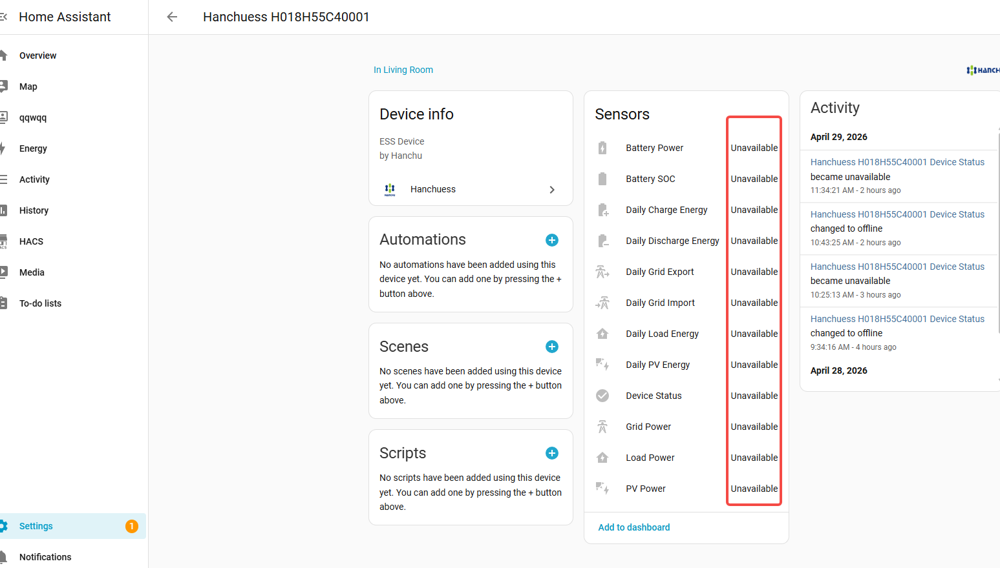
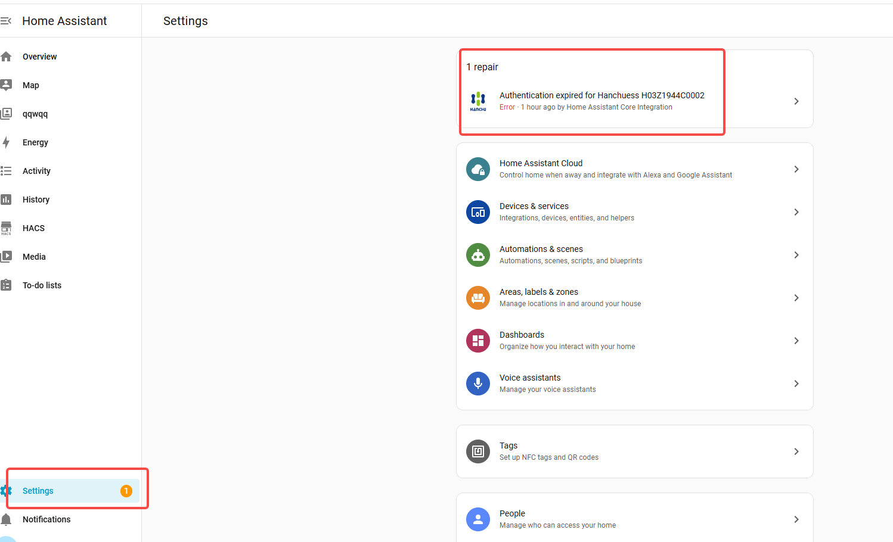
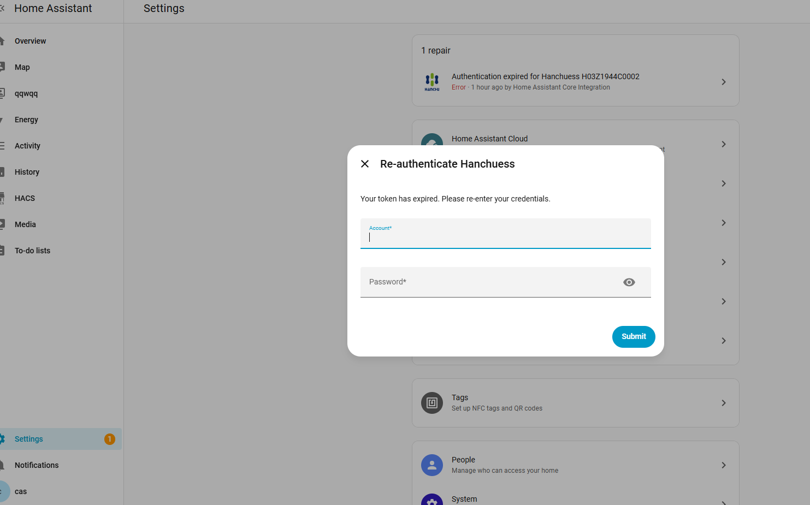
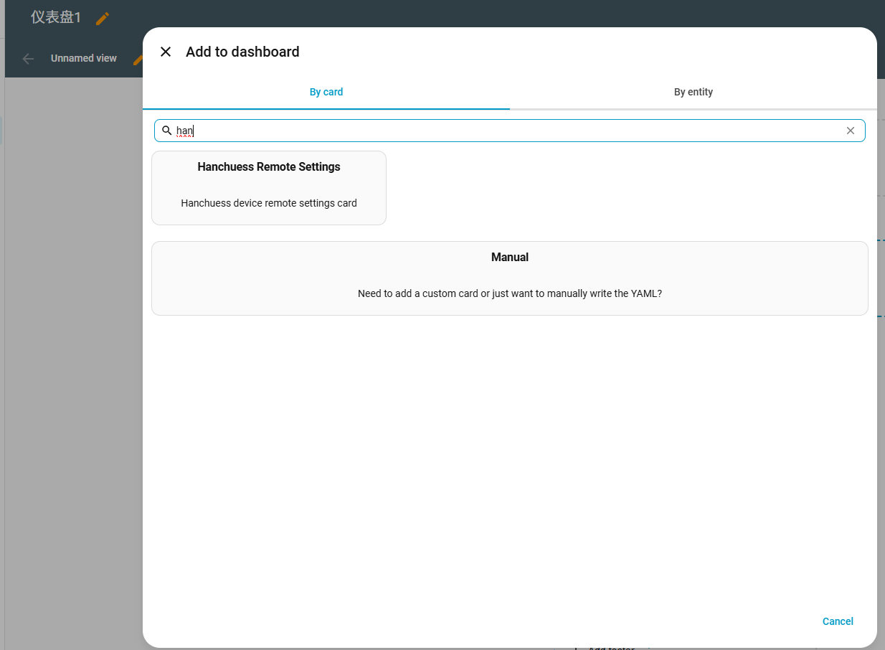

# Hanchuess Home Assistant Integration

A custom Home Assistant integration for monitoring and controlling Hanchuess ESS (Energy Storage System) devices.

## Features

- **Real-time Monitoring** — Battery SOC, PV power, grid power, load power, battery power, generator power (if available)
- **Daily Energy Statistics** — PV generation, battery charge/discharge, grid import/export, load consumption, generator energy (if available)
- **Remote Settings Card** — Custom Lovelace card for configuring work modes, charge/discharge time periods, and related parameters
- **Fast Charge/Discharge** — Quick charge or discharge with configurable duration and one-click stop
- **Multi-device Support** — Manage multiple devices under one account
- **Internationalization** — English and Simplified Chinese UI

## Installation

### Via HACS (Recommended)

1. Make sure [HACS](https://hacs.xyz/) is installed
2. Go to HACS → Integrations
3. Click the top-right menu → Custom repositories
4. Add this repository URL, category: Integration
5. Search for "Hanchuess" and install
6. Restart Home Assistant

### Manual Installation

1. Download this repository
2. Copy the folder to `config/custom_components/hanchuess/`
3. Restart Home Assistant

## Configuration

1. Go to **Settings → Devices & Services → Add Integration**
2. Search for **Hanchuess**
3. Enter your Hanchuess account credentials
4. Select the devices you want to add
5. Done

## Entities

### Sensors (Real-time, updated every 60s)

| Entity | Description |
|---|---|
| Device Status | Online / Offline / Pending |
| Battery SOC | Battery state of charge (%) |
| Battery Power | Battery charge/discharge power (W) |
| PV Power | Solar photovoltaic power (W) |
| Grid Power | Grid import/export power (W) |
| Load Power | Home load power (W) |
| Generator Power | Diesel generator power (W) — only if device has generator |

### Sensors (Statistics, updated every 5min)

| Entity | Description |
|---|---|
| Daily Load Energy | Today's load consumption (kWh) |
| Daily PV Energy | Today's PV generation (kWh) |
| Daily Charge Energy | Today's battery charge (kWh) |
| Daily Discharge Energy | Today's battery discharge (kWh) |
| Daily Grid Import | Today's grid import (kWh) |
| Daily Grid Export | Today's grid export (kWh) |
| Daily Generator Energy | Today's generator output (kWh) — only if device has generator |

## Token Expiration & Re-authentication

The Hanchuess cloud token has a limited validity period. When the token expires, the integration will automatically attempt to refresh it. If the refresh fails, all device entities will become **Unavailable**:

When this happens, go to **Settings** — you will see a repair notification at the top of the page:

Click the repair item, then re-enter your Hanchuess account and password in the dialog and click **Submit**:

After successful authentication, all devices will automatically recover and start reporting data again. If you have multiple devices, you only need to authenticate once — all devices share the same token.

## Custom Lovelace Card

The integration auto-registers a custom card **Hanchuess Remote Settings** which can be found under **Custom cards** when adding a card to your dashboard.

The card provides:

- **SN display** at the top
- **Fast Charge/Discharge** — Select mode (charge/discharge), set duration, confirm or stop with real-time countdown
- **Energy Settings** — Load and configure work mode, charge/discharge time periods, SOC limits, and other parameters from the device menu

> **Note:** If you cannot find the Hanchuess card when adding to dashboard, please clear your browser cache and refresh the page, or restart Home Assistant.

## License

MIT License
